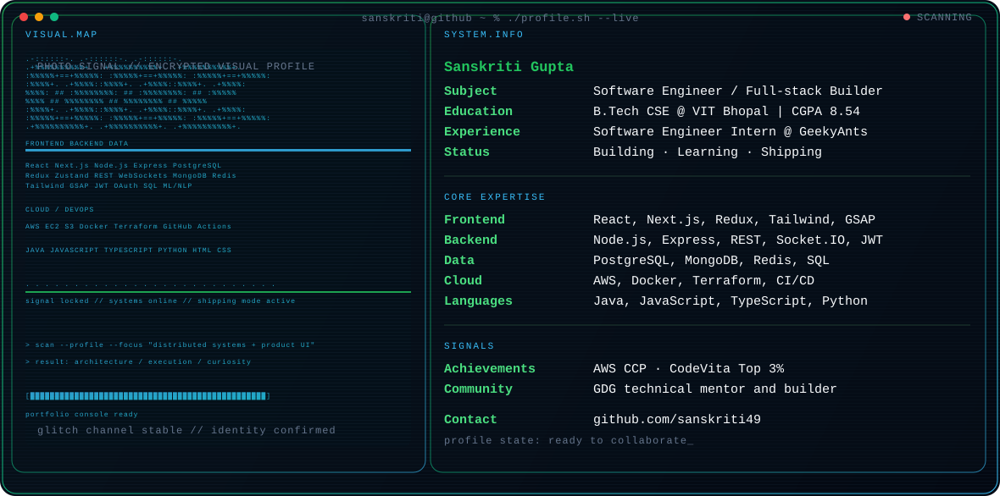

<div align="center">



<br />

[](https://github.com/sanskriti49)
[](https://linkedin.com/in/sanskriti49)
[](https://sanskriti49.github.io/my_portfolio/)

</div>

## `~/profile/about`

I'm Sanskriti Gupta, a Computer Science undergraduate at VIT Bhopal and a software engineer who enjoys building reliable systems behind polished product experiences. I work across frontend, backend, data, and cloud infrastructure, with a focus on turning complex workflows into clear, useful software.

**Currently:** strengthening distributed systems, real-time APIs, cloud-native architecture, and high-quality product interfaces.

## `~/profile/expertise`

```text
LANGUAGES     :: Java · JavaScript (ES6+) · TypeScript · Python · SQL · HTML5 · CSS3
FRONTEND      :: React.js · Next.js · Redux Toolkit · Zustand · Tailwind CSS · GSAP
BACKEND       :: Node.js · Express.js · REST APIs · WebSockets / Socket.IO · JWT · OAuth 2.0
DATA          :: PostgreSQL · MongoDB · Redis · spatial indexing · connection pooling
CLOUD / DEVOPS :: AWS EC2 · AWS S3 · Docker · Terraform · GitHub Actions · Linux · Postman
FOUNDATIONS   :: Data Structures & Algorithms · OOP · DBMS · Operating Systems
```

## `~/profile/experience`

**Software Engineer Intern · GeekyAnts**
Engineered role-based microservices and REST APIs with Node.js, Express.js, and PostgreSQL; built real-time Socket.IO channels and secure payment workflows with signature verification.

## `~/profile/selected-work`

### [Flux: Enterprise Agile Workspace](https://github.com/sanskriti49/agile_task_manager)

`Node.js` `PostgreSQL` `MongoDB` `Redis` `AWS S3` `Docker` `Terraform`

- Designed asynchronous multipart media uploads with AWS S3 presigned URLs.
- Combined PostgreSQL and MongoDB persistence with DFS cycle detection for task dependencies.
- Built distributed Socket.IO state sync with Redis Pub/Sub and sprint analytics with DORA metrics.

### [TaskGenie: On-Demand Hyperlocal Marketplace](https://github.com/sanskriti49/service-provider) · [Live product](https://taskgenieee.vercel.app/)

`Node.js` `Express.js` `PostgreSQL` `React.js` `Redis` `Razorpay` `Tailwind CSS`

- Built location-aware discovery using PostgreSQL GiST spatial indexing and Haversine scoring, reducing query latency by 80%.
- Engineered rolling availability slots with conflict detection, lead-time buffers, and a secure OTP completion handshake.
- Integrated KYC verification and Razorpay webhook reconciliation with HMAC validation and dispute refunds.

### [Udaan Scholarship Finder](https://github.com/sanskriti49/udaan-scholarship-finder)

`React` `Node.js` `Express` `MongoDB` `Google OAuth`

A full-stack scholarship discovery platform with authentication, eligibility flows, resources, and application guidance.

## `~/profile/activity`

<div align="center">



</div>

```text
CONTRIBUTION GRID :: generated from GitHub's live contribution calendar
RADAR STATUS     :: frontend online / backend online / cloud systems scanning
```

## `~/profile/achievements`

`AWS Certified Cloud Practitioner` · `TCS CodeVita Top 3% globally` · `GDG technical mentor`

<div align="center">

`Building systems that are useful, scalable, and a little delightful.`

</div>
